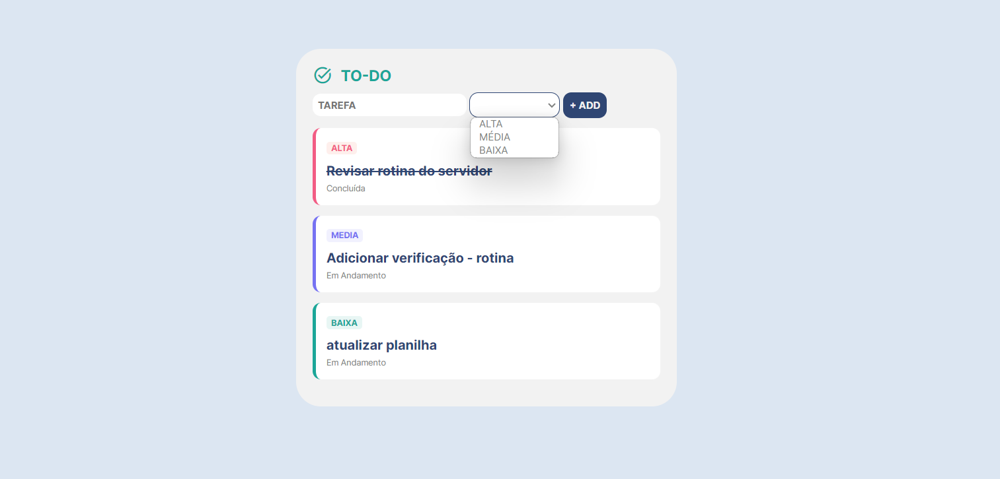

<h1 align="center"> TO-DO </h1>

  <a href="#-tecnologias">Tecnologias</a>&nbsp;&nbsp;&nbsp;|&nbsp;&nbsp;&nbsp;
  <a href="#-projeto">Projeto</a>&nbsp;&nbsp;&nbsp;|&nbsp;&nbsp;&nbsp;

  

 

  

## 🚀 Tecnologias

Esse projeto foi desenvolvido com as seguintes tecnologias:

- HTML, CSS, jQuery
- Git e Github

## 💻 Projeto

Tem algo de muito estranho acontecendo na sua cidade? Você pode entrar em contato com a equipe Mistério S.A. 

- [Visite o projeto online](https://lista-tarefas-jquery-kappa.vercel.app/)
